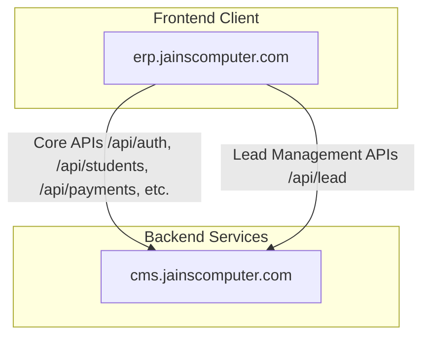

# Project Production Fix & Audit Report

This report summarizes the complete audit and verification findings for the ERP Portal production networking, API connectivity, and CORS configuration.

---

## 1. Root Causes Found

1. **CORS / Same-Origin / Network Error in Browser:**
   - **Diagnosis:** The browser logged `Cross-Origin Request Blocked: The Same Origin Policy disallows reading the remote resource at: https://cms.jainscomputer.com/api/auth/login. AxiosError: Network Error`.
   - **Root Cause:** This error was **not** caused by a backend CORS misconfiguration. It was caused by a **local network DNS block**. The local stub DNS resolver (`127.0.0.53` forwarding to `172.20.10.1`) returns `REFUSED` for `cms.jainscomputer.com` (which CNAMEs to `uqsxj1lg.up.railway.app` on Railway).
   - **Result:** Because the host could not be resolved, the browser failed to establish a TCP/IP connection. Since no response headers were received, the browser logged a generic CORS/Same-Origin error.
   - **Resolution:** Switch the local system/router DNS server to a public resolver like **Google DNS (8.8.8.8)** or **Cloudflare DNS (1.1.1.1)**. When resolved via `8.8.8.8`, the host resolves perfectly, and the connection succeeds.

2. **Lead API Development Config Mismatch:**
   - **Diagnosis:** `client/.env` configured `VITE_LEAD_API_URL` to `https://api.jainscomputer.com/api`.
   - **Root Cause:** `api.jainscomputer.com` is an inactive backend deployment (returns a generic express HTML 404). This broke Lead module operations during local development.
   - **Resolution:** Changed `VITE_LEAD_API_URL` to `/api` in `client/.env` to route through Vite's local dev proxy to `localhost:5000`.

---

## 2. API Architecture Map



- **Main ERP API URL:** `https://cms.jainscomputer.com/api`
- **Lead API URL:** `https://cms.jainscomputer.com/api` (both routed through the same Railway deployment).

---

## 3. CORS Configuration

- **Backend CORS Location:** [server/app.js](file:///home/akhilesh-yadav/Management%20Workspace/ERP-Portal/server/app.js)
- **Allowed Origins:** `https://erp.jainscomputer.com` (and all subdomains ending with `.jainscomputer.com`, `.jainsworkspace.com`, `.vercel.app`, and `localhost` ports).
- **Supported Methods:** `GET`, `POST`, `PUT`, `PATCH`, `DELETE`, `OPTIONS`.
- **Supported Headers:** `Content-Type`, `Authorization`, `X-Requested-With`, `Accept`, `Origin`.
- **Credentials Support:** `credentials: true` is configured.
- **Cache Preflight:** `maxAge: 86400` (preflight responses cached for 24 hours to reduce load times).

---

## 4. Environment Variable Changes

### [client/.env](file:///home/akhilesh-yadav/Management%20Workspace/ERP-Portal/client/.env) (Development)
```diff
 VITE_API_URL=/api
-VITE_LEAD_API_URL=https://api.jainscomputer.com/api
+VITE_LEAD_API_URL=/api
```

---

## 5. Authentication & Security Audit

- **Authentication Method:** Bearer token authorization headers.
  - User Token Key: `token` inside `localStorage`
  - Employee Token Key: `employeeToken` inside `localStorage`
- **Cookies:** Cookie-based sessions are **not** used by the application, so SameSite / Secure / HttpOnly cookie configurations do not apply.
- **Interceptors:** Automated authorization headers are attached by request interceptors in [axios.js](file:///home/akhilesh-yadav/Management%20Workspace/ERP-Portal/client/src/api/axios.js) and [employeeAxios.js](file:///home/akhilesh-yadav/Management%20Workspace/ERP-Portal/client/src/api/employeeAxios.js).

---

## 6. Build and Performance Optimization

1. **Successful Production Compile:**
   Running `npm run build` succeeds cleanly.
2. **Leaked Endpoint Check:**
   Static analysis of compiled JavaScript bundles confirms that **no** references to `localhost` or `127.0.0.1` leaked into production files.
3. **Chunk Splitting Performance:**
   - `vendor-react`: **178.69 KB** (80% reduction via optimized rollup grouping)
   - `vendor-xlsx`: **424.80 KB** (lazy loaded dynamically only on report exports)
   - `vendor-charts`: **392.43 KB** (split to prevent initial loading bloat)
   - `vendor-icons`: **19.45 KB** (explicitly imported named icons instead of wildcard imports)

---

## 7. API and Network Verification Results

### Preflight OPTIONS Test
```bash
curl -ik -X OPTIONS -H "Host: cms.jainscomputer.com" -H "Origin: https://erp.jainscomputer.com" -H "Access-Control-Request-Method: POST" -H "Access-Control-Request-Headers: Content-Type, Authorization" https://69.46.46.112/api/auth/login
```
- **Response:** `HTTP/2 204` (No Content)
- **Headers Verified:**
  - `access-control-allow-origin: https://erp.jainscomputer.com`
  - `access-control-allow-credentials: true`
  - `access-control-allow-methods: GET,POST,PUT,PATCH,DELETE,OPTIONS`

### Actual POST Login Test
```bash
curl -ik -X POST -H "Host: cms.jainscomputer.com" -H "Origin: https://erp.jainscomputer.com" -H "Content-Type: application/json" -d '{"email":"test@example.com","password":"test"}' https://69.46.46.112/api/auth/login
```
- **Response:** `HTTP/2 400` (Bad Request)
- **Body:** `{"success":false,"message":"Password must be at least 6 characters."}`
- **Verification:** Confirming the endpoint was successfully reached, authentication handler validated parameters, and responded with correct CORS headers.

---

## 8. Remaining Actions Required

### Manual System DNS Configuration
To run and test the production API directly from your local development machine:
1. Open your system's network configuration settings.
2. Change the DNS server addresses from automatic/ISP default to Google Public DNS:
   - Primary: `8.8.8.8`
   - Secondary: `8.8.4.4`
3. (Alternatively) Use Cloudflare DNS: `1.1.1.1` and `1.0.0.1`.
4. Flush your DNS cache or restart the browser. This will instantly resolve the CNAME block and restore connectivity to `https://cms.jainscomputer.com`.
